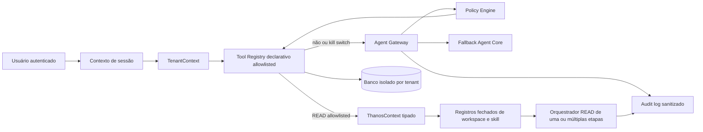

# Baseline de Arquitetura

## Propósito e estado consolidado

Este documento descreve o estado verificável do Assistente Pastoral após a evolução de Gateway, catálogo declarativo, auditoria enriquecida, Dashboard gerencial, Configurações administrativas e o ciclo THÁNOS. Ele permanece a referência de compatibilidade: nenhuma entrega posterior pode reduzir o isolamento por organização, expor transcrições, segredos ou raciocínio interno, nem eliminar o caminho local quando provedores novos estiverem indisponíveis.

## Componentes atuais

| Camada | Estado atual | Garantia a preservar |
|---|---|---|
| Autenticação | Manus OAuth e cookie de sessão seguro de primeira parte. | A identidade do usuário só é derivada da sessão validada pelo servidor. |
| Multi-tenant | Organizações, memberships e `organizationId` em entidades pastorais. | O cliente nunca escolhe o tenant como fonte de autoridade. |
| Chat | Conversas persistentes, propriedade por usuário, histórico isolado e roteador público THÁNOS opt-in. | Um segundo usuário, mesmo da mesma igreja, não lê conversas alheias; o caminho legado continua disponível. |
| Agent Gateway e Agent Core | Gateway por tenant, política, Model Router, fallback local e catálogo declarativo de ferramentas. | Nenhum modelo ganha acesso direto a SQL, repositórios ou rotas internas. |
| Voz | Áudio privado, transcrição interna, marcador de voz sem texto reconhecido e TTS do navegador; após a transcrição, a resposta passa pelo `AgentGateway`. | Áudio e transcrição não entram em mensagens visíveis ou auditoria; o mesmo `requestId`, política e fallback do Gateway são preservados, sem ampliar o piloto THÁNOS `chat`-only. |
| Auditoria | Eventos de ferramenta, voz e Hermes com `requestId`, resultado, confirmação e provedor/modelo, sem chain-of-thought. | Logs permanecem sanitizados e filtrados por tenant. |
| Dashboard | Métricas gerenciais, tendências, pendências com escopo declarado e insights determinísticos. | A tela continua a visão gerencial principal, não é substituída por chat ou IA generativa. |
| Configurações | Área administrativa por papel para status e controles allowlisted. | Nenhum segredo, URL sensível, tool ou workflow arbitrário é criado pela interface. |
| Núcleo THÁNOS | Contexto tipado, registros fechados, orquestração de leitura e portas sanitizadas; bootstrap com workspace Pastoral e prova sintética READ-only. | `workspaceKey`, `tenantId` e `domain` são identidades distintas e não intercambiáveis; o segundo workspace não recebe rota pública nem ferramentas pastorais. |
| Platform access | `platformRole` e `platformCapabilities` explícitos no `ThanosContext`, com `superadmin` apenas quando capabilities globais específicas forem concedidas. | Role e capabilities do tenant não concedem acesso de plataforma; ausência ou capability desconhecida é deny; não existe rota pública de assunção nesta etapa. |
| Planner READ | Plano interno declarado de 2–5 passos, preflight de capabilities, intenção somente `READ`, contexto fresco por passo e fallback parcial. | Não substitui o piloto público nem permite tool arbitrária; cada passo preserva tenant, workspace, domain e `requestId`. |
| Evidência | Proveniência generalizada por fonte, workspace, tenant, requestId, ferramenta e etapa; composição sanitizada. | Não inclui prompt privado, áudio, transcrição, segredo ou chain-of-thought; o provider recebe apenas evidência e fallback permitidos. |
| Workspace Pastoral | Skill `pastoral-assistant`, adaptadores declarativos READ e fachada compatível. | A skill aceita apenas `chat`, exige `agent:read` e não permite `WRITE` ou `SENSITIVE`. |
| Piloto multi-step | Duas ou três leituras pastorais fixas — células, presença e relatórios — sob um único contexto. | Aceita somente 2–3 passos READ; falha operacional retorna fallback determinístico sem expor erro bruto. |
| Roteamento público THÁNOS | Elegibilidade server-side por flag, allowlists de organização/usuário e intenção READ fechada. | O kill switch retorna imediatamente ao legado; `WRITE`, `SENSITIVE`, voz e intenções fora da allowlist não entram no piloto. |

## Fluxos obrigatórios

O fluxo de voz utiliza a mesma cadeia depois da transcrição privada, entrando pelo `AgentGateway` com um `requestId` compartilhado entre transcrição, resposta e auditoria. Antes de o Gateway receber a intenção, o sistema persiste somente o marcador **Mensagem de voz**; a transcrição não é persistida. O fluxo de texto persiste a mensagem do usuário conforme a política de conversa existente. A skill do piloto THÁNOS permanece limitada ao canal `chat`, portanto a convergência de voz não altera a audiência nem as intenções elegíveis do piloto.

## Limites inegociáveis

| Limite | Regra |
|---|---|
| Banco e repositórios | Somente executores confiáveis podem acessá-los; modelos e conectores externos não recebem credenciais ou consultas livres. |
| Escritas | Exigem ferramenta cadastrada, schema validado, role autorizada, escopo derivado do servidor e confirmação quando definida pela matriz de risco. |
| Contexto de tenant | Sempre vem da membership autenticada; `organizationId` enviado pelo cliente, modelo ou provedor nunca é aceito como autoridade. |
| Segredos | Chaves, URLs sensíveis, variáveis de ambiente e objetos de erro brutos não são serializados para a UI, logs ou auditoria. |
| Automação externa | Começa desativada, allowlisted e sem URLs ou workflows arbitrários. |

## Critério de compatibilidade e rollback

Com Hermes desativado, indisponível ou inválido, o comportamento de texto e voz continua a usar o Agent Core local. O Dashboard tradicional continua disponível se a camada inteligente falhar. O n8n fica sem execução externa enquanto desativado. Toda migração é aditiva e reversível logicamente por configuração, com `AGENT_GATEWAY_PROVIDER=legacy`, `HERMES_ENABLED=false` e `N8N_ENABLED=false` como retorno operacional seguro.

## Adoção controlada do THÁNOS

O chat público avalia a elegibilidade no servidor antes da execução. O piloto inicia **desativado** e exige `THANOS_PILOT_ENABLED=true`, uma audiência explícita de organização e/ou usuário e uma intenção READ pertencente à allowlist fechada. `THANOS_PILOT_KILL_SWITCH=true` impede a rota THÁNOS imediatamente, sem depender de interface ou cliente. As allowlists nunca são retornadas ao browser, nem persistidas como metadados de auditoria.

Quando elegível, o roteador persiste a mensagem do usuário uma única vez, mantém o mesmo `conversationId`, `requestId` e `TenantContext`, e invoca a fachada Pastoral. A falha inesperada delega ao `AgentGateway` com `persistUserMessage=false`, evitando duplicidade. O fallback determinístico interno também é marcado como tal na telemetria, sem serializar causa bruta, stack, segredo ou identificador de audiência.
